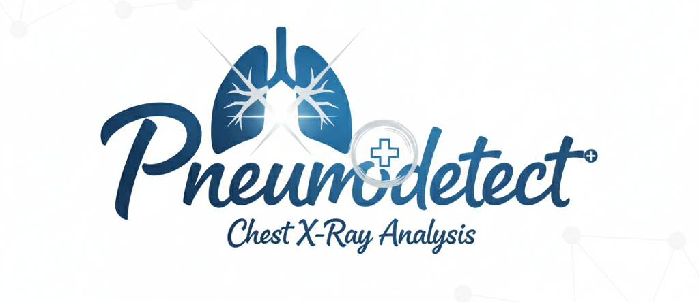

# PneumoDetect: Chest X-Ray Analysis


[](https://github.com/YOUR_USERNAME/YOUR_REPO_NAME/actions)

PneumoDetect is a full-stack web application designed to classify chest X-ray images for the detection of pneumonia. It leverages a powerful deep learning model served via a high-performance FastAPI backend, with a clean, responsive front end for user interaction. The entire application is containerized with Docker for easy setup and is automatically tested using a GitHub Actions CI pipeline.

## Features

-   **FastAPI Backend:** A robust API built with FastAPI to handle image processing and prediction requests.
-   **Efficient ML Inference:** Utilizes a pre-trained `EfficientNetV2-S` model converted to the ONNX format for fast, CPU-based inference.
-   **Clean & Responsive Frontend:** A simple user interface built with HTML, CSS, and vanilla JavaScript that works on both desktop and mobile.
-   **Fully Containerized:** The entire application stack (Frontend Web Server & Backend API) is managed by Docker and Docker Compose for one-command setup.
-   **Automated Testing:** A comprehensive test suite using `pytest` validates the backend logic and API endpoints.
-   **Continuous Integration:** A GitHub Actions workflow automatically runs all tests on every push and pull request to ensure code quality.

## Tech Stack

| Component | Technology | Description |
| :--- | :--- | :--- |
| **Backend** |  | Core programming language. |
| |  | High-performance web framework for the API. |
| | **ONNX Runtime** | For efficient, cross-platform model inference. |
| **Frontend**|  | Structure of the web application. |
| |  | Styling the user interface. |
| |  | Handling user interaction and API calls. |
| **Testing** |  | A robust framework for testing the Python backend. |
| **Deployment & CI/CD**|  | Containerization of the application. |
| | **Docker Compose** | Orchestrating the multi-container setup. |
| |  | Serving the frontend and acting as a reverse proxy. |
| |  | Automating the CI testing pipeline. |

## Project Structure

The project is organized into a clean, scalable structure:

```
.
├── .github/
│   └── workflows/
│       └── tests.yml-------------------# GitHub Actions workflow for CI
├── api/
│   ├── tests/--------------------------# Backend tests
│   │   ├── conftest.py-----------------# Pytest fixtures and test setup
│   │   ├── create_dummy_model.py-------# Generates a lightweight model for testing
│   │   ├── test_main.py----------------# Tests for the FastAPI API layer (main.py)
│   │   └── test_pipeline.py------------# Unit tests for the inference logic (pipeline.py)
│   ├── Dockerfile----------------------# Blueprint for the backend container
│   ├── main.py-------------------------# Main FastAPI application logic
│   └── pipeline.py---------------------# Handles the ONNX model inference
├── frontend/
│   ├── assets/
│   ├── css/
│   ├── js/
│   ├── Dockerfile----------------------# Blueprint for the frontend Nginx container
│   ├── index.html
│   └── nginx.conf
├── saved_models/
│   └── efficientnet_v2_s_best.onnx-----# The trained .onnx model file
├── .dockerignore
├── docker-compose.yml
├── .gitignore
├── .gitattributes----------------------# Configures Git LFS for .onnx files
└── requirements.txt--------------------# Python dependencies


```

---

## Getting Started

Follow these instructions to get the project up and running on your local machine.

### Prerequisites

You must have the following software installed:

-   **Docker:** [Get Docker](https://docs.docker.com/get-docker/)
-   **Docker Compose:** (Usually included with Docker Desktop)
-   **Git:** [Get Git](https://git-scm.com/downloads)
-   **Git LFS:** [Install Git LFS](https://git-lfs.com/). This is required to download the trained model file.

### Installation & Setup

1.  **Clone the repository:**
    ```bash
    git clone https://github.com/YOUR_USERNAME/YOUR_REPO_NAME.git
    cd YOUR_REPO_NAME
    ```

2.  **Update the CI Badge (Optional):**
    In `README.md`, replace `YOUR_USERNAME` and `YOUR_REPO_NAME` in the badge URL at the top of the file with your actual GitHub username and repository name.

---

## Running the Application

With Docker and Docker Compose, running the entire application is a single command.

1.  **Build and run the containers:**
    From the root directory of the project, run the following command:
    ```bash
    docker-compose up --build
    ```
    This command will build and start the `frontend` and `backend` containers.

2.  **Access the application:**
    Once the containers are running, open your web browser and navigate to:
    **[http://localhost:8080](http://localhost:8080)**

3.  **Stopping the application:**
    Press `Ctrl + C` in the terminal, then run `docker-compose down` to stop and remove the containers.

## How to Use

1.  Click the **"Choose an Image"** button.
2.  Select a chest X-ray image (`.jpeg` or `.png`) from your computer.
3.  A preview of the selected image will be displayed.
4.  Click the **"Predict"** button.
5.  The application will show a loading spinner while the backend processes the image.
6.  The result, including the predicted class (**NORMAL** or **PNEUMONIA**) and the confidence score, will be displayed.

---

## Testing and Continuous Integration

### Running Tests Locally

The backend includes a comprehensive test suite using `pytest`.

1.  **Install development dependencies:**
    Ensure your `requirements.txt` includes `pytest`, `pytest-mock`, `httpx` and `onnx`. Then install them into your virtual environment:
    ```bash
    pip install -r requirements.txt
    ```

2.  **Run the test suite:**
    From the root directory of the project, execute `pytest`:
    ```bash
    python -m pytest
    ```
    This will automatically discover and run all tests in the `api/tests/` directory.

### Continuous Integration (CI)

This project uses **GitHub Actions** to automatically run the test suite for every `push` and `pull request` to the `main` and `develop` branches. This ensures that new changes do not break existing functionality.

The workflow is defined in the `.github/workflows/tests.yml` file and performs the following steps:
1.  Checks out the latest code.
2.  Sets up a specific version of Python.
3.  Installs all required dependencies from `requirements.txt`.
4.  Generates a dummy ONNX model to make tests fast and self-contained.
5.  Runs the entire `pytest` suite.

You can view the status and logs of the CI runs under the "Actions" tab of this repository.

---

## API Endpoint Documentation

The API is not directly exposed to the host machine. All requests must go through the Nginx proxy running on port `8080`.

### `/predict`

-   **Method:** `POST`
-   **Description:** Uploads an image file for pneumonia classification.
-   **URL:** `http://localhost:8080/predict`
-   **Body:** `multipart/form-data` with a key named `file`.

**Example using `curl`:**
```bash
curl -X POST -F "file=@/path/to/your/xray.jpeg" http://localhost:8080/predict
```

#### Success Response (200 OK)
```json
{
  "class": "PNEUMONIA",
  "confidence": 0.9876
}
```

#### Error Response (400 Bad Request)
If the file is not an image:
```json
{
  "detail": "File is not an image. Uploaded file type is: application/pdf"
}
